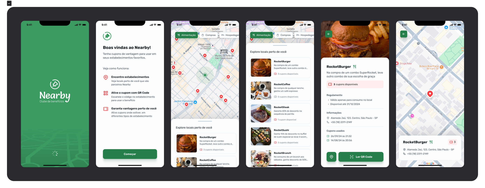

[REACT_NATIVE_BADGE]: https://img.shields.io/badge/react%20native-61DAFB?style=for-the-badge&logo=react&logoColor=white
[TYPESCRIPT__BADGE]: https://img.shields.io/badge/typescript-D4FAFF?style=for-the-badge&logo=typescript
[REACT__BADGE]: https://img.shields.io/badge/React-005CFE?style=for-the-badge&logo=react
[PROJECT__BADGE]: https://img.shields.io/badge/📱Visit_this_project-000?style=for-the-badge&logo=project
[PROJECT__URL]: https://clinica-maravilha.vercel.app/

<h1 align="center" style="font-weight: bold;"> Nearby - Mobile 📱</h1>

![typescript][TYPESCRIPT__BADGE] 
![react_native][REACT_NATIVE_BADGE]

<p align="center">
 <a href="#about">Sobre</a> • 
 <a href="#started">Começando</a> • 
  <a href="#started">Interfaces da aplicação</a> • 
  <a href="#colab">Colaboradores</a> •
 <a href="#contribute">Contribuição</a>
</p>

<p align="center">
    
</p>

<h2 id="started">📌 Sobre</h2>

Bem-vindo ao repositório do app mobile Nearby, o projecto é um aplicativo de clube de benefícios com cuppons para utilizar em estabelecimentos próximos a você.

<!-- [![project][PROJECT__BADGE]][PROJECT__URL] -->

<h2 id="started">🚀 Começando</h2>

<h3>Pré-requisitos</h3>

Pré-requisitos necessários para executar o projeto:

- Node.js (v22 ou superior)
- npm (v10 ou superior)

<h3>Clonando</h3>

Para clonar o repositório siga os seguintes passos: 

```bash
git clone https://github.com/Emanuel-Marques/nearby-mobile.git
```

<h3>Executando a Aplicação</h3>

Para executar o a aplicação siga os seguintes passos: 

```bash
cd nearby-mobile
npm install
npx expo start
```
<!-- Isso iniciará o servidor de desenvolvimento e você poderá visualizar a aplicação em `http://localhost:3000/`. -->

<h2 id="routes">📍 Intefaces da Aplicação</h2>

Todas as inetrfaces disponíveis na aplicação
| Interface               | Descrição                                          
|----------------------|-----------------------------------------------------
| <kbd>Splash</kbd>     | Interface de splash com o logo do app
| <kbd>Start</kbd>     | Interface com informações sobre o app
| <kbd>Details</kbd>     | Interface com detalhes do estabelecimento .

<h2 id="colab">🤝 Colaboradores</h2>

Um agradecimento especial a todas as pessoas que contribuíram para este projeto.

<table>
  <tr>
    <td align="center">
      <a href="#">
        <br>
        <sub>
          <b>Emanuel Marques</b>
        </sub>
      </a>
    </td>
  </tr>
</table>

<h2 id="contribute">📫 Contribuição</h2>

Contribuições são bem-vindas! Por favor, faça um fork do repositório e envie um pull request para quaisquer melhorias ou correções de bugs.

1. `git clone https://github.com/Emanuel-Marques/nearby-mobile.git`
2. `git checkout -b feature/NAME`
3. Siga os padrões de commit
4. Abra um Pull Request explicando o problema resolvido ou o recurso criado, se houver, anexe uma captura de tela das modificações visuais e aguarde a revisão!

## Licença

Este projeto é licenciado sob a Licença MIT.

## Contato

Para qualquer dúvida ou feedback, entre em contato pelo email [Emanuel Marques](emanuelmarques585@gmail.com).

---
​
